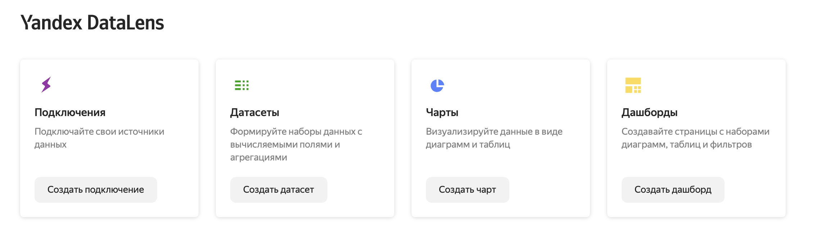

# Дашборды для бизнес-аналитики в Yandex DataLens 

[Yandex DataLens](https://datalens.yandex.ru/)  - сервис для бизнес-аналитики. 

Сущности DataLens:

- **Подключение**  - получение доступа к данным
- **Датасет**  - ваши данные
- **Чарт** — визуализация данных (диаграммы, карты, таблицы  и др.)
- **Дашборд** — набор чартов, фильтров и текстовых пояснительных блоков.



## Шаг 0. Источник данных

Мы будем работать с датасетом [Титаник](https://www.kaggle.com/competitions/titanic/overview)  - информация о 1309 пассажиров Титаника. 

Данные представлены в формате `.csv` (Comma-Separated Values ) — текстовый формат, предназначенный для представления табличных данных. Строка таблицы соответствует строке текста, которая содержит одно или несколько полей, разделенных запятыми.

Столбцы датасета:

* `PassengerId` - ID пассажира
* `Pclass` - класс билета
* `Name` - имя
* `Sex` - пол
* `Age` - возраст (годы)
* `Sibsp` - это число братьев, сестер или супругов на борту у человека.
* `Parch` - количество родителей, детей (в том числе приемных)
* `Ticket` - номер билета
* `Fare` - стоимость билета
* `Cabin` - значение признака описывается палубой и номером каюты.
* `Embarked` - порт посадки. 10 апреля 1912 года «Титаник» отправился из Саутгемптона (S) в Нью-Йорк, совершив остановки во французском Шербуре (С) и ирландском Квинстауне (Q).
Survived (0 - не выжил, 1 - выжил)

## Шаг 1. Подключение 

Создайте в  `Yandex DataLens` новое подключение: выберите "File" и в качестве источника выберите  `titanic.csv`.

При создании подключения выбери “показывать заголовки столбцов”, тогда названия столбцов подтянутся из таблицы автоматически (если этого не сделать, то заголовки отобразятся в таблице в качестве первой строки).

## Шаг 2. Датасет

Создадим датасет на основе загруженного файла `titanic.csv`. 

При создании и редактировании датасетов можно:
- изменить тип данных поля
- переименовать поле
-  добавить поля данных, вычисляемые поля
- изменить правила агрегации

Для дальнейшей работы преобрабатайте данные:

- Измените Агрегацию по полю `PassengerId` на "Количество уникальных".
- Переименуйте поле `Survived` в `Survived_code`.
- Создайте новое вычисляемое поле `Survived`

```
CASE [Survived_code]
    WHEN 1 THEN "Survived"
    ELSE "Not survived"
END
```

### Шаг 3. Чарты

Создайте чарты: 

1. столбчатую диаграмма, на которой будет показано сколько мужчин и женщин выжили или не выжили на Титанике. 

2.  Круговую диаграмму распределения, сколько людей купило билеты 1, 2 и 3 класса

3. Сводную таблицу, показывающую тепловую карту, сколько выжило в зависимости от класса.

4. Добавьте индикатор процента выживших

5. Добавьте карту с количеством пассажиров в зависимости от порта посадки.

В вычисляемом поле можно использовать следующую формулу:

```
CASE [Embarked_code]
    WHEN "S" THEN GEOPOINT(50.897222, -1.406944) 
    WHEN "C" THEN GEOPOINT(51.851, -8.2967)
    ELSE GEOPOINT(49.638889, -1.616111)
END
```

### Шаг 4. Дашбоард

1. Добавьте на дашбоард все сделанные чарты.
2. Добавьте селектор по полу и по классу билета.
3. Добавьте описание и выводы.

### Дополнительные материалы

[Бесплатный курс «Основы работы с DataLens» от Яндекс.Практикум](https://practicum.yandex.ru/ycloud-datalens/)


